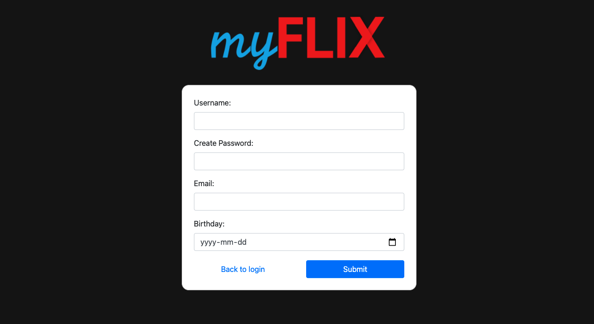
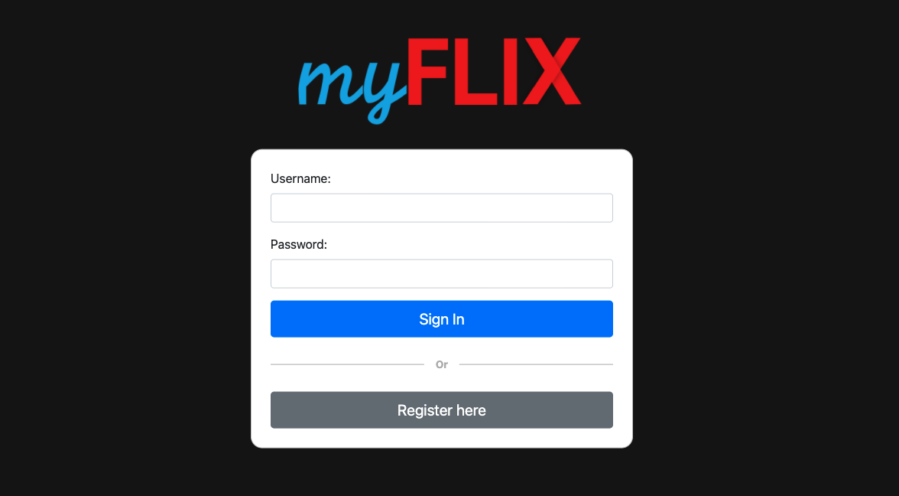
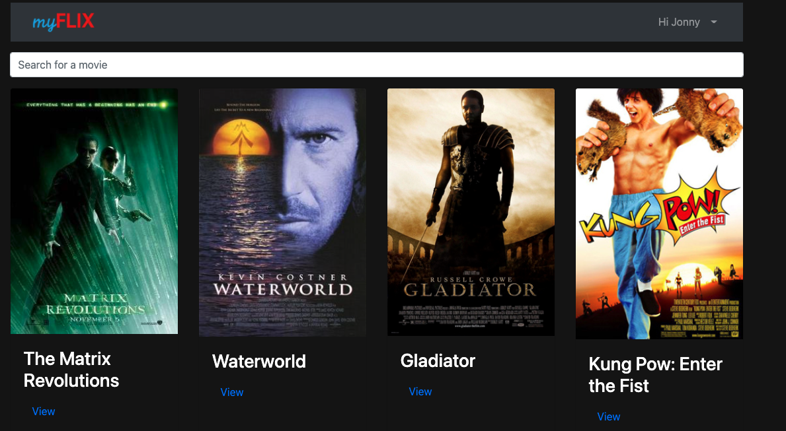
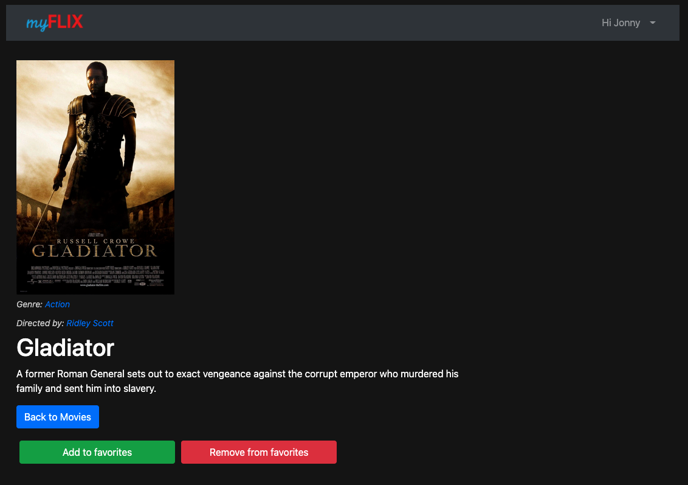
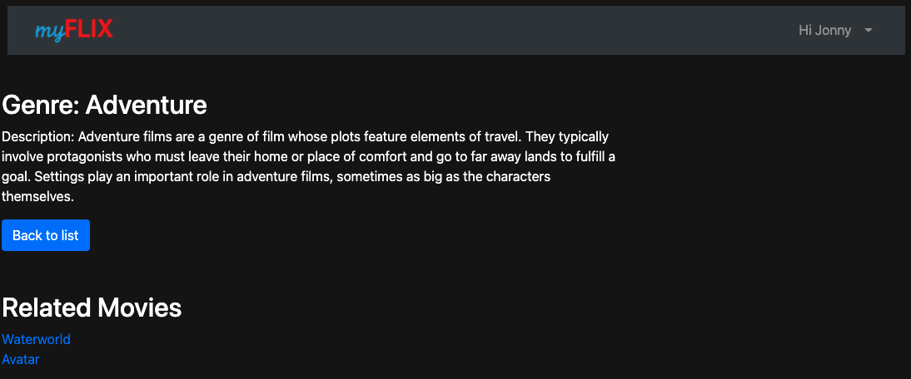
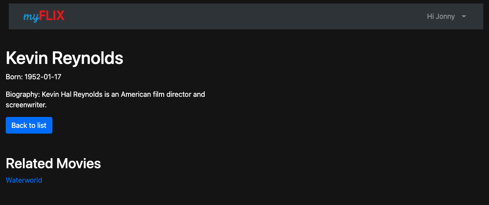
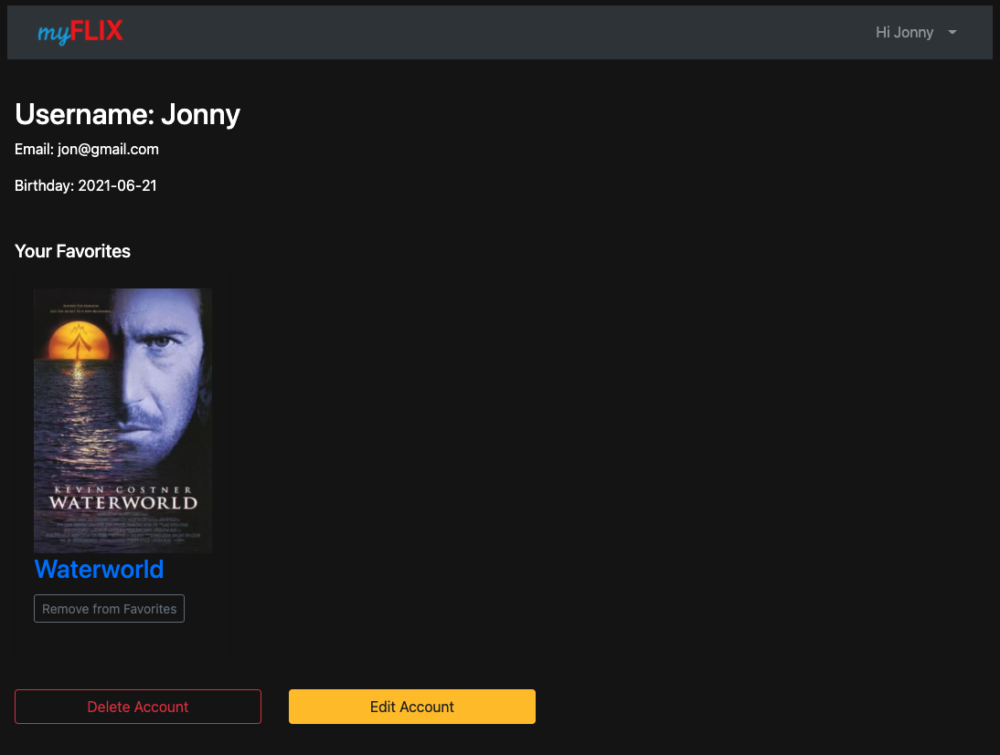
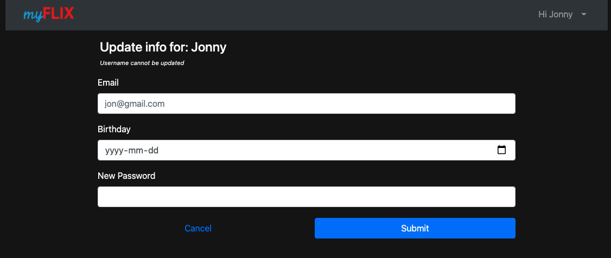

<h1>MyFlix Application</h1>

This repo is the frontend single page application.

This single page application is built using React with Redux, while using React-Bootstrap as a framework. User Authentication is using JWT-based authentication and basic HTTP authentication. The database is built with MongoDB and Express and is hosted on Heroku.

<h3>Tools Used</h3>
React
React-Bootstrap
Redux

<h3>Dependencies</h3>
<ul>
  <li>axios</li>
  <li>prop-types</li>
  <li>react</li>
  <li>react-bootstrap</li>
  <li>react-bootstrap-floating-label</li>
  <li>react-dom</li>
  <li>react-hook-form</li>
  <li>react-redux</li>
  <li>react-router-dom</li>
  <li>redux</li>
  <li>redux-devtools-extension</li>
</ul>

<h3>devDependencies</h3> 
<ul>
  <li>parcel/transformer-image</li>
  <li>parcel/transformer-sass</li>
  <li>sharp</li>
</ul>

<h3>Start Application</h3>

parcel src/index.html

<h3>Application Features</h3>

The application includes the ability to register new users/login, view available movies, see genre details with related movies, see director details with related movies, edit profile details and add/remove favorite movies from your user profile. screenshots below

<h3>Registration View</h3>

<h3>Login View</h3>

<h3>Main View</h3>

<h3>Movie View</h3>

<h3>Genre View</h3>

<h3>Director View</h3>

<h3>Profile View</h3>

<h3>Update View</h3>

